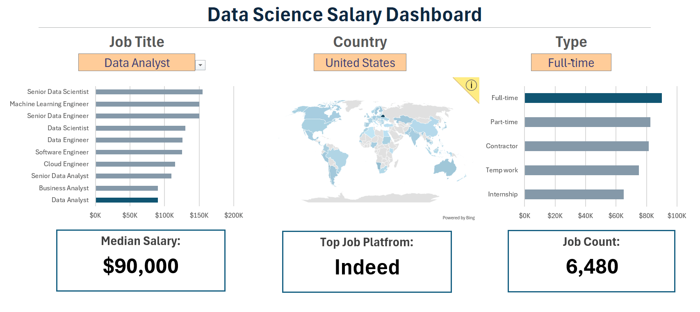
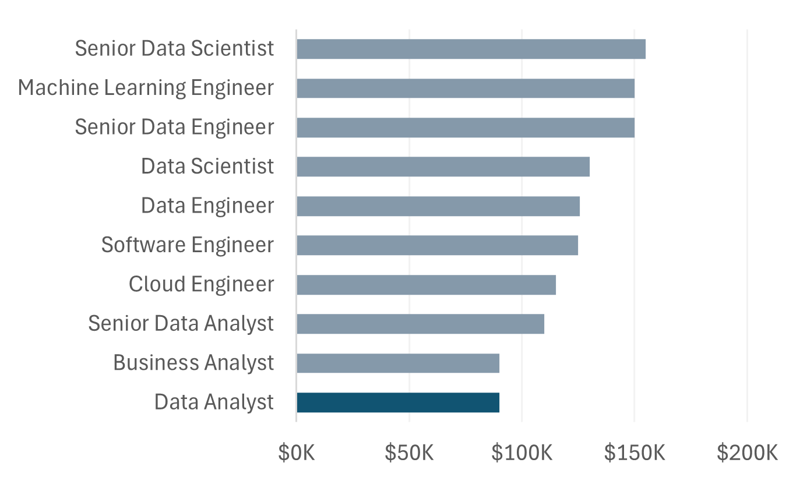
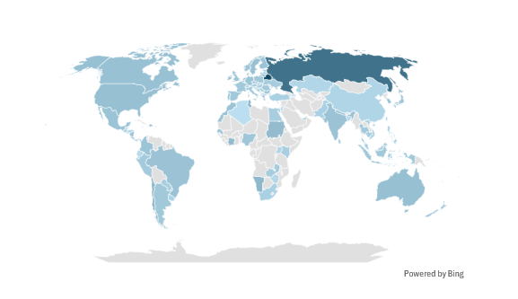
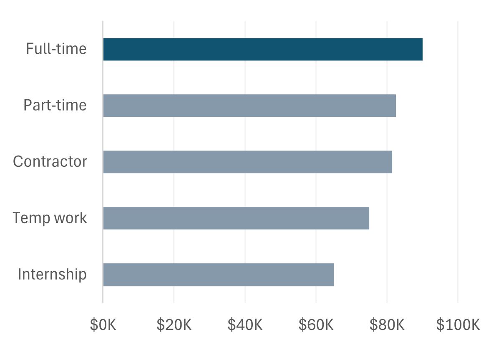
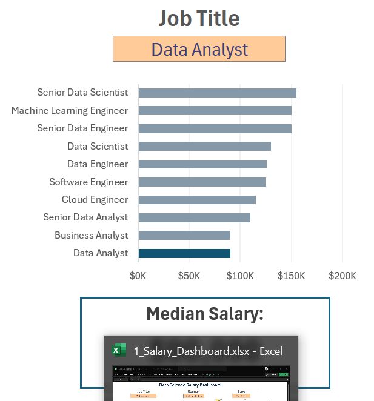

# 📊 **Data Science Salary Dashboard**


## **Overview** 🚀

This dashboard was developed to assist job seekers in analyzing salary trends for data-related roles, helping them make informed career decisions. It provides insights into **job titles**, **salary ranges**, **locations**, and **key skills** required in the field.

📌 **Dataset Source:** [Luke Barousse](https://www.youtube.com/@LukeBarousse)'s Excel course on YouTube, which he also uses to build [Data Nerd Tech](https://datanerd.tech/).

## **📂 Dashboard File**

📌 **Final Dashboard:** [1_Salary_Dashboard.xlsx](1_Salary_Dashboard.xlsx)

## **📊 Excel Skills Used**

This project leveraged various Excel techniques, including:

- 📈 **Data Visualization** (Charts)
- 🧮 **Formulas & Functions**
- ✅ **Data Validation**

## **📄 Dataset Details**

The dataset comprises **real-world salary information** for **data science jobs from 2023**. It serves as a valuable resource for understanding industry trends and includes:

- 👨‍💼 **Job Titles**
- 💰 **Salary Ranges**
- 📍 **Locations**
- 🛠️ **Required Skills**

This project showcases the power of **Excel for salary analysis**, offering a **clear and interactive way** to explore the **data job market** for data nerds like me 🤓.

## **📊 Building the Dashboard**

### **📌 Charts**

#### **📊 Data Science Job Salaries - Bar Chart**



- 📊 A **bar chart** is used to easily compare salary differences across data jobs.
- 🔢 The data is **sorted in descending order**, from the **highest-paying job** to the **lowest-paying job**.
- 🎯 The **selected job title** is **highlighted** to improve readability.
- 💡 **Insights**: This chart makes it easy to find the **median yearly salaries** for different data jobs. **Senior roles** and **engineering positions** tend to be **higher-paying** than other data analyst jobs.

#### **🗺️ Median Salaries by Country - Map Chart**



- 🌍 A **map chart** is used to **visualize median salaries** for data jobs across different countries.
- 💡 **Insights**: This chart helps **quickly identify salary disparities** and compare **high- and low-paying regions**.

#### **📊 Data Science Job Median Salaries by Job Type - Bar Chart**



- 📊 A **bar chart** is used to show the **yearly median salaries** for different data science job types.
- 💡 **Insights**: This chart allows us to **quickly see salary differences** across job types. **Full-time positions** tend to be **the highest-paying job type**.

## **🔢 Formulas and Functions**

### **📌 Median Salary by Job Title**

```
=MEDIAN(
    IF(
        (jobs[job_title_short] = A7) *
        (jobs[job_country] = country) *
        (ISNUMBER(SEARCH(type, jobs[job_schedule_type]))) *
        (jobs[salary_year_avg] <> 0),
        jobs[salary_year_avg]
    )
)
```

- ✅ This formula checks for the **job title, country, and job type** selected by the user.
- 📊 `MEDIAN()` and `IF()` are used to **calculate the median salary** while **filtering the data accordingly**.
- 📌 The formula returns a **table showing median salaries** for each job title **based on the selected country and job type**.

### **📌 Count of Job Schedule Type**

```
=FILTER(
    J2#,
    (NOT(
        ISNUMBER(SEARCH("and", J2#)) + 
        ISNUMBER(SEARCH(",", J2#))
    )) * (J2# <> 0)
)
```

- ❌ This formula **excludes any values** containing `"and"` or `","` and also **removes zero values** from the list of **job schedule types**.
- 🎯 This helps in **identifying unique job schedule types**.

## **✅ Data Validation**



- 🎛️ The **Data Validation** feature in **Excel** is used to **create filtered lists** for `Job Title`, `Country`, and `Job Schedule Type`, allowing users to **dynamically filter the dashboard**.

## **🎯 Conclusion**

---

- 🎨 I created this **dashboard** to showcase my **skills in Excel**, including **data analysis, chart creation, and dashboard building**.
- 🛠️ The dashboard can be **a useful tool** for users like me who are **interested in data-related jobs**, helping them **make informed career decisions** based on salary trends.