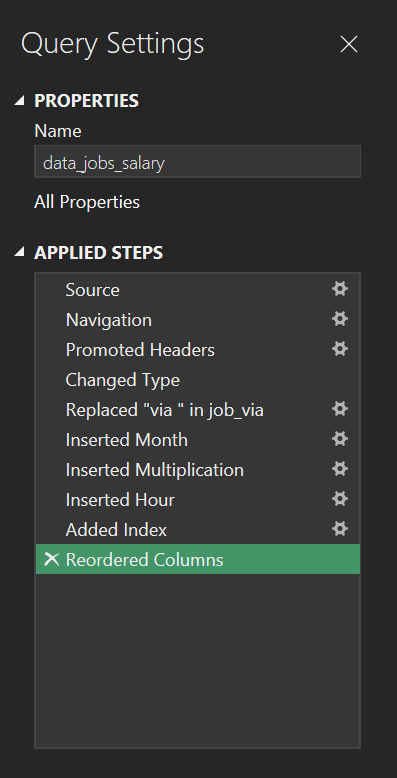
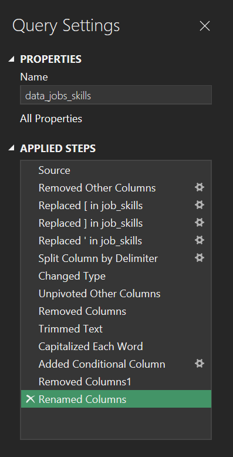
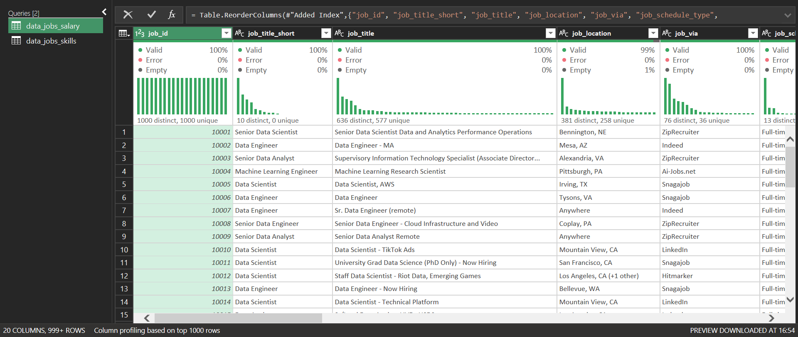
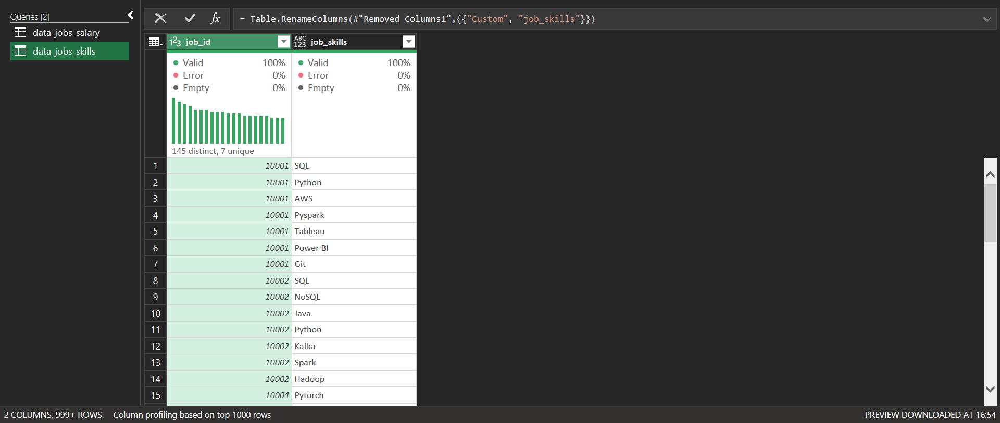
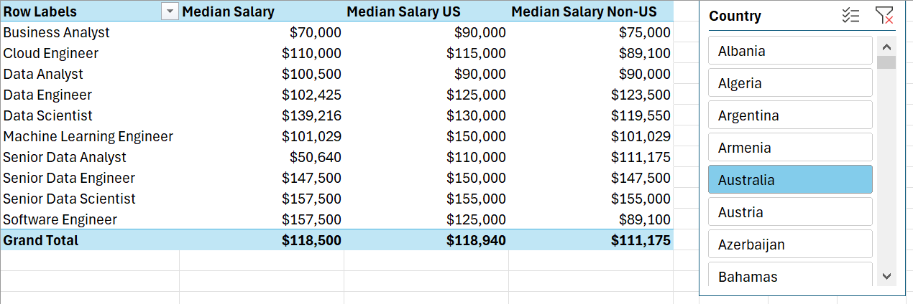
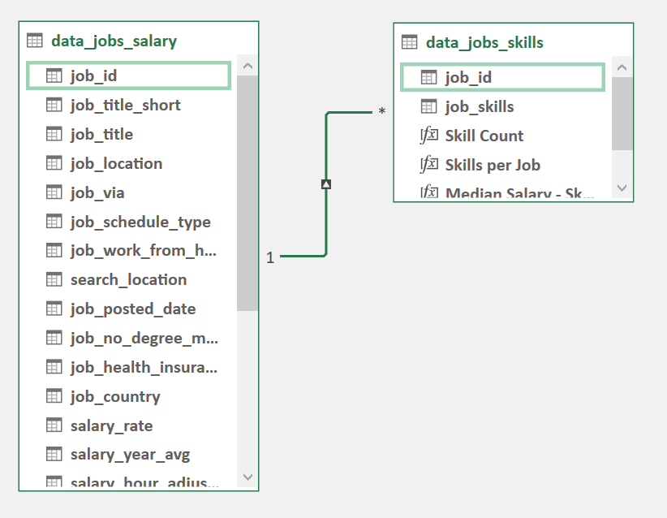
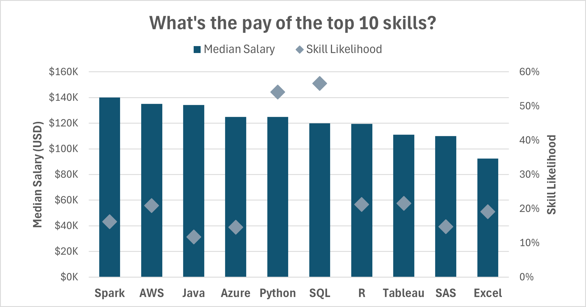

# 📊 **Data Jobs Salary Analysis**

## 🔎 **Introduction**

I’m currently looking for a **📊 Data Analyst job**, and I wanted to explore the **📈 job market** to understand:

- 🛠️ **What skills are in demand**
- 💰 **How skills impact salaries**
- 🎯 **What top employers look for**

This project helps me (and others) see which skills lead to better job opportunities and higher pay.

## ❓ **Questions I Analyzed**

I explored the following questions using a dataset on **data science jobs**:

🔹 **📈 Do more skills lead to higher salaries?**  
🔹 **🌍 How do salaries vary by region?**  
🔹 **💻 What are the most in-demand skills for data professionals?**  
🔹 **💰 What’s the average pay for the top 10 skills?**

## 🛠️ **Excel Skills Used**

To analyze the data, I used:

- 📊 **Pivot Tables** – Summarized and compared salaries  
- 📈 **Pivot Charts** – Visualized trends  
- 🧮 **DAX (Data Analysis Expressions)** – Created custom calculations  
- 🔍 **Power Query** – Cleaned and transformed the data  
- 💪 **Power Pivot** – Built a data model

## 📂 **Dataset Overview**

📌 **Dataset Source:** [Luke Barousse](https://www.youtube.com/@LukeBarousse)'s Excel course on YouTube, which he also uses to build [Data Nerd Tech](https://datanerd.tech/). This dataset includes real job postings from **2023**, with insights into:

- 👨‍💼 **Job titles**  
- 💰 **Salaries**  
- 📍 **Locations**  
- 🛠️ **Required skills**

This project showcases my ability to **analyze job market data using Excel**.

# **📊 Key Findings**

## 1️⃣ **Do More Skills Lead to Higher Salaries?**

### **🔍 Skill Used: Power Query (ETL)**

#### 📥 **Extract**

I used Power Query to extract data from `data_salary_all.xlsx` and created two queries:

- 🗃️ `data_jobs_salary` – Full job listings
- 🔧 `data_job_skills` – Skills listed for each job

#### 🔄 **Transform**

I cleaned the data by:  
- ✅ Changing column types  
- ✅ Removing unnecessary columns  
- ✅ Cleaning text & trimming spaces
- ✅ Added new columns

**🗃️ `data_jobs_salary`**



**🔧 `data_job_skills`**]



#### 💾 **Load**

I loaded the cleaned data into the workbook for further analysis.

**🗃️ `data_jobs_salary`**



**🔧 `data_job_skills`**



#### 📊 **Analysis & Insights**

![[skills_vs_pay_scatter.png]]

- 📈 **More skills = Higher salary** (especially for **Senior Data Engineers** & **Data Scientists**)
- 💼 Jobs with fewer required skills (**e.g., Business Analyst**) offer lower salaries

🤔 **Why It Matters**  
- 📌 Learning multiple relevant skills **boosts salary potential** and **career growth**.

---

## 2️⃣ **Salary Trends in Different Regions**

### **🧮 Skills Used: PivotTables & DAX**

📈 **Pivot Table**

- Built a **PivotTable with Power Pivot**
- Used a **DAX measure** to calculate median salary for **US jobs**

```DAX
=CALCULATE(
    MEDIAN(data_jobs_all[salary_year_avg]),
    data_jobs_all[job_country] = "United States"
)
```

#### 📊 **Analysis & Insights**  



- 💼 **Senior Data Engineers** & **Data Scientists** earn the highest salaries globally.  
- 💰 **US-based tech jobs** pay significantly more due to the concentration of **tech industries**.

🤔 **Why It Matters**  
- 💡 Helps professionals **negotiate salaries** and **understand pay differences by region**.

---

## 3️⃣ **Top Skills for Data Professionals**

### **🔧 Skill Used: Power Pivot**

💪 **Power Pivot**  
- 🔗 I built a **data model** by combining the `data_jobs_all` and `data_job_skills` tables.  
- 🧹 Since the data was already **cleaned in Power Query**, Power Pivot **linked the tables automatically**.

🔗 **Data Model**  
- I created a **relationship** between the two tables using the **job_id** column.



#### 📊 **Analysis & Insights**


- 💻 **SQL & Python** are the most in-demand skills, proving their importance.  

🤔 **Why It Matters**  
- 📌 Professionals should **focus on learning high-demand skills** to stay competitive.

---

## 4️⃣ **Salaries for the Top 10 Skills**

### **📊 Skill Used: Advanced Pivot Charts**

📈 **Pivot Chart**

- Created a **combo chart** comparing **median salaries & skill demand**
- Used **Clustered Columns** (salaries) & **Line Markers** (skill likelihood)

#### 📊 **Analysis & Insights**  



- 💰 **Spark, AWS, and Java** offer the highest salaries, but they appear in fewer job postings.
- 📈 While **Python and SQL** salaries are not as high as the others, these skills are the most in demand.

🤔 **Why It Matters**  
- 📌 Learning **high-value skills** (Python, SQL, Cloud Tech) leads to **higher salaries**.

---

# 🎯 **Conclusion**

As a **data analyst job seeker**, I explored real job postings to uncover trends in:  

- ✅ **Salaries** 📊  
- ✅ **Job roles** 💼  
- ✅ **Top skills** 🛠️
### **Key Takeaways:**

- 💡 **More skills = Higher pay**  
- 💡 **Python, SQL, and Cloud skills are in demand**  
- 💡 **US tech jobs pay significantly more**

📌 I hope this project helps others **understand job market trends** and **make informed career decisions**! 
